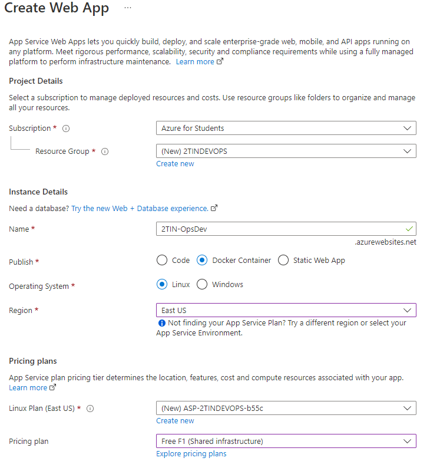
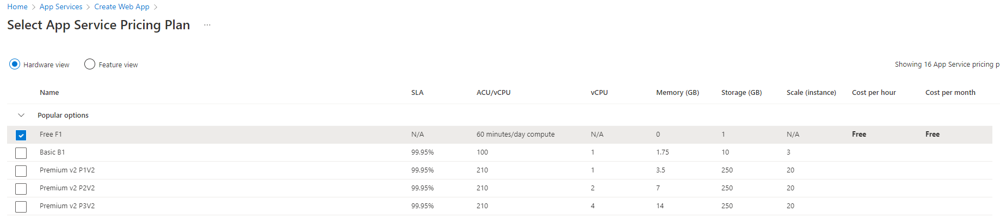

# Lab DevOps
`Add the badge here (see assignment below)`

## Introduction
The company OpsDev has been secretly following our DevOps workshop and has jumped on the chance to implement a CI/CD pipeline for their own calculator app. However, the company considers itself allergic to Jenkins and (locally hosted) virtual machines.

You have just started as a junior in the company OpsDev and are responsible for setting up a CI/CD pipeline. You cannot use Jenkins (which we didn't touch upon in the workshop anyway) or virtual machines. At the direction of Kevin, head of operations, you will be using Github actions and docker. This repository contains their amazing calculator application.


_In a new file, solutions.md, describe the use of github actions and docker in your own words. Which companies are behind these systems? What is the goal?_


_For this assignement you will need an account on [dockerhub](https://hub.docker.com/), create one now_

# Let's get started!
OpsDev values quality and feedback, so a CI/CD pipeline is a must-have for the company. Sadly, nobody working there currently has the required knowledge to build a CI/CD pipeline.

For the continious integration phase, you will be using Github actions. Github actions are part of the Github ecosystem, something you will make eager use of during this lab. Follow the documentation carefully to get a working pipeline.

 _Let's start greenfield with the github action quickstart guide which you can find [here](https://docs.github.com/en/actions/quickstart). Apply the quickstart to this repository._


_Github actions uses yaml files. What are yaml files? What does the structure and syntact of a yaml file look like. Document this in solutions.md_

# CI workflow
The first part of our CI "workflow", which is what we call our pipeline in Github actions, is that the github repository code is pulled into the github runner. Create a new workflow, which you'll call '<your_name>-OpsDev-CI'. This workflow will run on a ubuntu system with a step that will pull the code from the repository to the runner. If you get stuck, try consulting the quickstart guide again.
We'll need to consider when we want to trigger this workflow. You can find more information on the different triggers [here](https://docs.github.com/en/actions/learn-github-actions/events-that-trigger-workflows). Make sure the workflow triggers when a push is made to the main branch, but also make sure we can manually start the workflow.


_Start the pipeline manually to make sure the workflow functions correctly. Look at the output in the actions tab of the repository._

After pulling the code, we would like to run the application's unit tests. To do this, we'll first need to install all the dependencies (node_modules) of the application. The application is built using Node.js, which stores its dependencies in the node_modules folder which is usually left out of the repository using the .gitignore file. The 'npm install' command will reinstall the dependencies. To be able to run the command, we'll need to install nodeJS. This [documentation](https://docs.github.com/en/actions/automating-builds-and-tests/building-and-testing-nodejs-or-python) might help. Add a step that will integrate nodeJS into the the workflow, then install the dependencies. Finally, make sure the workflow runs the unit tests.

Right now, our workflow is factually stateless because it runs on a virtual runner that gets destroyed when the workflow ends. Therefore, we would like the rapport generated by the unit tests to be archived. Add a step that will do this for us. More information can be found [here](https://docs.github.com/en/actions/advanced-guides/storing-workflow-data-as-artifacts).

Feedback is important! It is possible to add a badge to the top of this 'README.MD' that will show the status of the latest build attempt. Use this [documentation](https://docs.github.com/en/actions/monitoring-and-troubleshooting-workflows/adding-a-workflow-status-badge) to add such a badge to the top of the readme file.


_Let's get a bit more experience with github actions. Visit [github actions hero](https://github-actions-hero.vercel.app/lessons/1) and try to do every lesson. You'll encounter a few features we haven't covered here._

# Integration pull requests
Update our CI workflow so it also runs when a pull request is made. You can test this by adding a new feature to the calculator. This new feature will allow the calculator to calculate exponentials. If you're at all familiar with Node.js, any small change to the codebase will do. After you add your feature, create a pull request from your feature branch. Make sure the workflow is executed. 

# Continuous delivery
Add a new workflow to your repository. Name it '<your_name>-OpsDev-CD'. This workflow will only be started manually. The goal of this workflow will be to build a container and push this container to dockerhub (Your boss is a big fan of Docker, in fact, he owns several t-shirts with Docker prints on it). 


_What exactly is Dockerhub? What can we use it for? Document your findings in solutions.md._


_Create a new repository on dockerhub. Name it opsdev-calculator. Make sure the repository is set to public. Copy paste your link below:

```
https://hub.docker.com/r/YOURURL
```


Here are some pointers for setting up your CD pipeline:

*   You will need access to your login credentials (username & personal access token) for dockerhub. Remember that workflows are part of your repository and we don't want these secrets as part of the repository. 
    _tip: Use [Github secrets](https://docs.github.com/en/actions/security-guides/encrypted-secrets)_
*   Use the following 2 actions plugins:
    - https://github.com/marketplace/actions/docker-login
    - https://github.com/marketplace/actions/build-and-push-docker-images
    


_Because we don't have time to deep-dive into how Docker works, we have provided a dockerfile in this repository. However, it is a good exercises to delete the DockerFile and try to build it yourself from scratch. In any case, make sure you can run the project locally using docker. (Also remember to use npm install when setting up your own Dockerfile/container)_


_If you have a working DockerFile, you can start building and pushing the image to dockerhub. Use the documentation linked above. Check on dockerhub that your image was pushed successfully.

**!Remember: The credentials cannot be visibible in the yml file!**

Every time we successfully build an image, we want to be notified in our company discord server. Create your own discord server (or use an existing one) and add discord alerts. Here's a useful [link](https://github.com/marketplace/actions/actions-for-discord). Similar to our DockerHub credentials, we don't want our webhook url to be visible in the yml file.


_Why are we using secrets for the credentials and the webhook URL? What is the advantage? Are there any other ways you could approach this?_

# Deploy to Azure
Via [this link](https://azure.microsoft.com/nl-nl/free/students/) you can get access to a free student account on Microsoft Azure. You will get a $100 to spend on the cloud platform. It is important to use your school email for this.


_What is Microsoft Azure? Who are its biggest competitors?_

The build and push to dockerhub is not an actual deployment. As an additional challenge, let's add a push to the Azure app services using github actions. This is a service you can use to easily host and start docker containers which will then be available on the internet.

Use the menu to navigate to _app services_. Make a new app with the following settings (the names used here are the names we use at the PXL, feel free to change them up a bit):



Make sure you choose the "FREE F1" tier as the "pricing plan". You might need to click on the link _explore pricing plans_ to find it:



Next, once deployment is complete, in the overview page, look for the _Download Publish profile_ button. Add the contents of this file as a secret to your gthub repository using the name `AZURE_WEBAPP_PUBLISH_PROFILE` (This is necessary to get access to Azure for deployment). 

For the remaining deployment steps for your CD workflow, take a look at the following [documentation](https://docs.github.com/en/actions/deployment/deploying-to-your-cloud-provider/deploying-to-azure/deploying-docker-to-azure-app-service#creating-the-workflow)
 
 _tip: the absolute url to a public docker image will look something like this: `docker.io/samagtenpxl/opsdev-calc`_

# Deliverables
- A CI workflow
- A status badge in the `README.md` file
- A CD workflow
- The link to your dockerhub image in solutions.md
- The link to you publicly available calculator app in 'solutions.md'


